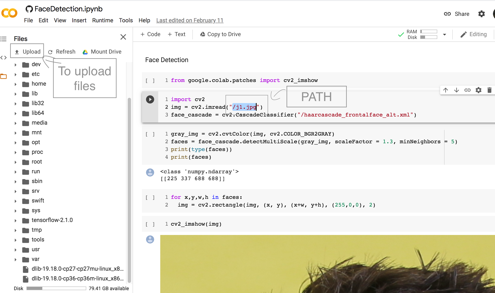

# FaceDetection
Using OpenCV 

Step 1:- Open the "FaceDetection.ipynb" file in Colaboratary.

Step 2:- Download the "haarcascade_frontalface_alt.xml" and "j1.jpg" files.

Step 3:- Inside colab go to Files and Upload both the files.

  

Step 4:- Than run the code cell, one by one.(shortcut(shift + enter)).

Step 5:- You can upload the picture that you want. If yes follow the steps below:-
         
         1. Upload the picture on colab.
         
         2. Change the address in code cell-2 line-2.
         
         3. Go to Step 4.

Congratulation! You are now able to detected the face from photos.

Enjoy!!!
